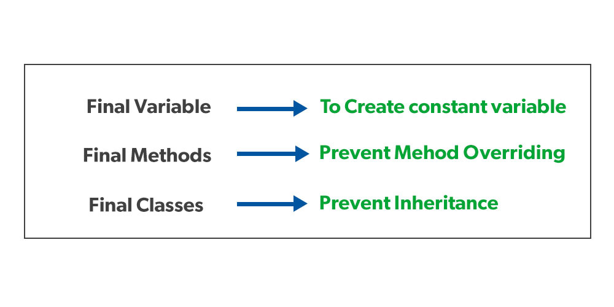
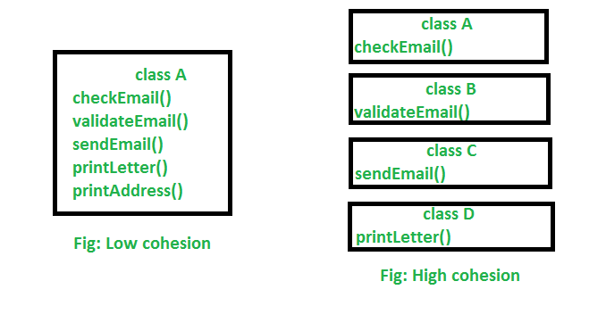
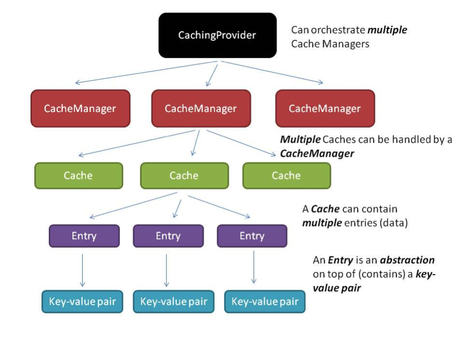
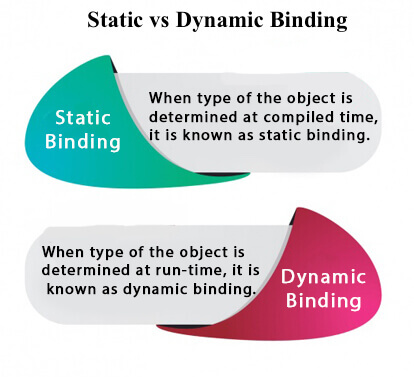
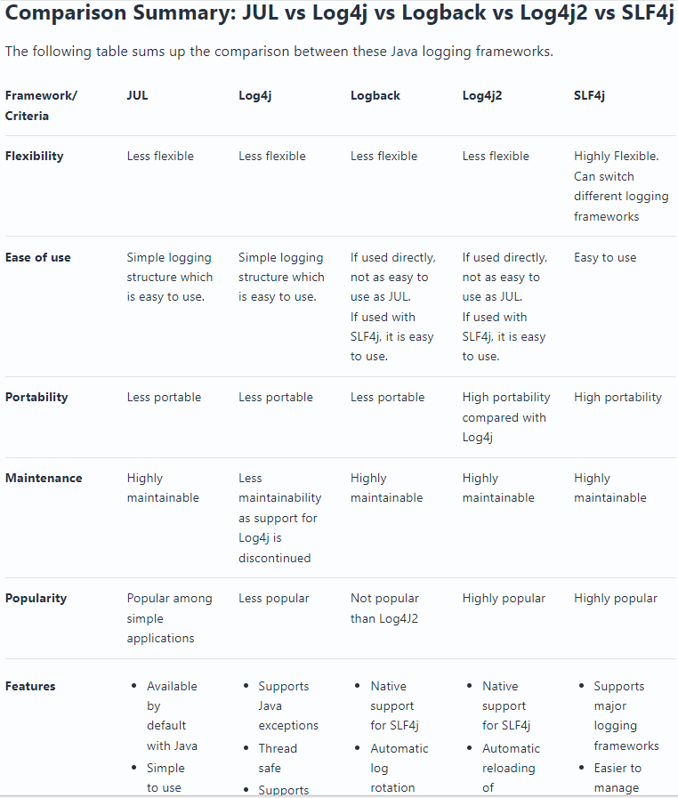
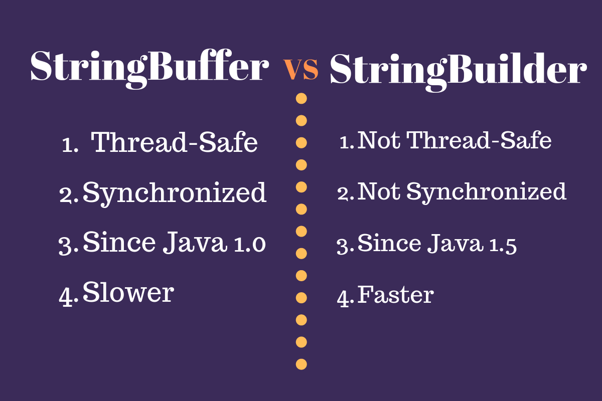
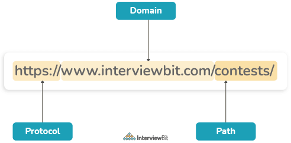
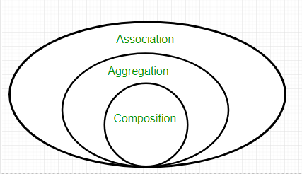

<!-- TOC -->
  * [variables:](#variables)
  * [Float and double](#float-and-double)
  * [int vs Integer](#int vs Integer)
    * [Compile time Error](#compile-time-error)
      * [Two types:-](#two-types-)
    * [Run Time error](#run-time-error)
    * [* Constant *](#--constant-)
    * [* Value *](#--value-)
    * [* Field *](#--field-)
    * [* Property *](#--property-)
  * [Primary main features of java:](#primary-main-features-of-java)
  * [Identifiers](#identifiers)
* [Modifier in Java](#modifier-in-java)
  * [1. Access modifiers](#1-access-modifiers)
    * [private access modifier](#private-access-modifier)
    * [private constructor](#private-constructor)
    * [Default access modifier](#default-access-modifier)
  * [2- Non-access Modifiyers](#2--non-access-modifiyers)
* [OOP(Object Oriented Programming)](#oopobject-oriented-programming)
  * [1 . Polymorphism](#1--polymorphism)
  * [2 . Inheritance](#2--inheritance)
  * [3 . Encapsulation - hiding the information.](#3--encapsulation---hiding-the-information)
  * [4 . Abstraction - Absstract factory pattern](#4--abstraction---absstract-factory-pattern)
  * [5 . Interface](#5--interface)
    * [Marker interface vs Functional Interface](#marker-interface-vs-functional-interface)
    * [Implements and Extends](#implements-and-extends)
    * [Interface and Abstract](#interface-and-abstract)
* [Collections](#collections)
    * [Methods used:-](#methods-used-)
  * [List](#list)
  * [Set](#set)
  * [Map](#map)
  * [Exception Handling](#exception-handling)
  * [Syncronization](#syncronization)
  * [Aplet](#aplet)
  * [Serialization and Deserialization](#serialization-and-deserialization)
* [Auto-boxing and Auto-Unboxing](#auto-boxing-and-auto-unboxing)
    * [Boxing & AutoBoxing - Primitive values to Object or wrapper class.](#boxing--autoboxing---primitive-values-to-object-or-wrapper-class)
    * [UnBoxing & AutoBoxing - Object to primitive type.](#unboxing--autoboxing---object-to-primitive-type)
* [Cohesion and Coupling in Java](#cohesion-and-coupling-in-java)
  * [Coupling](#coupling)
    * [Loose coupling](#loose-coupling)
    * [Tight Coupling](#tight-coupling)
  * [Cohesion](#cohesion)
* [Java Questions](#java-questions)
  * [1. Caching in java](#1-caching-in-java)
  * [Size() vs length()](#size-vs-length)
  * [What design patterns are used, explain the reason for the usage](#what-design-patterns-are-used-explain-the-reason-for-the-usage)
    * [Singleton pattern](#singleton-pattern)
      * [Factory pattern](#factory-pattern)
      * [Abstract pattern](#abstract-pattern)
      * [Builder pattern](#builder-pattern)
      * [Adapter pattern](#adapter-pattern)
      * [Decorator pattern](#decorator-pattern)
      * [Observer pattern](#observer-pattern)
      * [Strategy pattern](#strategy-pattern)
      * [Command pattern](#command-pattern)
      * [MVC pattern](#mvc-pattern)
  * [10. Pass by value and Pass by reference](#10-pass-by-value-and-pass-by-reference)
  * [14. How to compile simple applications](#14-how-to-compile-simple-applications)
  * [15. What are required to run simple Java applications](#15-what-are-required-to-run-simple-java-applications)
  * [16. What is the difference between JDK and JRE](#16-what-is-the-difference-between-jdk-and-jre)
  * [17. Is it possible run the application with JRE](#17-is-it-possible-run-the-application-with-jre)
  * [18. What is JVM](#18-what-is-jvm)
  * [19. What are collection, how collections are used](#19-what-are-collection-how-collections-are-used)
  * [20. Hashmap, what is the complexity of traversing](#20-hashmap-what-is-the-complexity-of-traversing)
  * [Stream API](#stream-api)
  * [Data Binding](#data-binding)
    * [Static Binding](#static-binding)
      * [Override static method](#override-static-method)
    * [Dynamic Binding](#dynamic-binding)
  * [24. Cqrs Pattern, what is the solution scenario used](#24-cqrs-pattern-what-is-the-solution-scenario-used)
  * [25. What build tool used](#25-what-build-tool-used)
  * [26. What is the difference between install and deploy](#26-what-is-the-difference-between-install-and-deploy)
  * [27. connection pooling in java](#27-connection-pooling-in-java)
    * [Connection Pooling](#connection-pooling)
      * [Benefits of connection pooling](#benefits-of-connection-pooling)
  * [Comparable and Comparator](#comparable-and-comparator)
  * [Equals() & HashCode(), Equals()](#equals--hashcode-equals)
  * [Eden space in java](#eden-space-in-java)
  * [PermGen Space (Permanent Generation) and Meta Space](#permgen-space-permanent-generation-and-meta-space)
    * [PerGen vs Meta space](#pergen-vs-meta-space)
  * [URL vs URI](#url-vs-uri)
  * [Session management](#session-management)
  * [Loggers](#loggers)
* [Strings](#strings)
  * [String vs StringBuffer vs StringBuilder, String Pool](#string-vs-stringbuffer-vs-stringbuilder-string-pool)
    * [String vs StringBuffer](#string-vs-stringbuffer)
    * [String pool](#string-pool)
  * [String Manipulation__](#string-manipulation)
  * [Why string is immutable in java](#why-string-is-immutable-in-java)
    * [To Create immutable class](#to-create-immutable-class)
  * [URL vs URI](#url-vs-uri-1)
  * [Try with Resource](#try-with-resource)
      * [The first is a typical try-catch-finally block:](#the-first-is-a-typical-try-catch-finally-block)
      * [try-with-resources With Multiple Resources](#try-with-resources-with-multiple-resources)
      * [A Custom Resource With AutoCloseable](#a-custom-resource-with-autocloseable)
  * [Initialization vs Instatiation](#initialization-vs-instatiation)
  * [Java Singleton Class design pattern](#java-singleton-class-design-pattern)
  * [Anonymous class](#anonymous-class)
  * [Factory Design pattern](#factory-design-pattern)
  * [Authentication and Authorization](#authentication-and-authorization)
  * [Static Block in java < 1.5](#static-block-in-java--15)
  * [ConcurrentModificationException / Fail-Fast and Fail-Safe](#concurrentmodificationexception--fail-fast-and-fail-safe)
  * [Transient Keyword](#transient-keyword)
  * [Association, Composition and Aggregation in Java](#association-composition-and-aggregation-in-java)
  * [Arbitrary Number of Arguments and @SafeVarags](#arbitrary-number-of-arguments-and-safevarags)
  * [Load balancing](#load-balancing)
<!-- TOC -->

## variables:

* ```local``` - Inside the body of method, and it can not be static.

* ```instance``` - Inside the body of class.

* ```static``` - It can not be local, we can share the copy and share among all the instances of class. Memory is allocated only once when the class is loaded.

***

## Float and double

Double is more precious than float, where double takes 8 bytes and can provide precision up to 15 to 16 digits and float takes 4 bytes and provides precision upto 6 to 7.

* Both double and float are approximate types and not precise(accurate or exact).

## [int vs Integer](https://stackoverflow.com/questions/8660691/what-is-the-difference-between-integer-and-int-in-java)

***

- [final - keyword](https://www.geeksforgeeks.org/final-keyword-in-java/)



- finally - block used after try catch

- finalize - method for clean up. Garbage collection

***

### Compile time Error

#### Two types:-

1. Syntax Error

2. Semantic Error


### Run Time error

if divisible by 0.

***

### * Constant *

public static final String name="Sarath";

### * Value *

final String dontChange="India";

### * Field *

protected String rever="Gana";

### * Property *

private String age;

***

**CLASS** - Class is a collection of objects.

**OBJECTS** – Is a memory representation of a class

**Implicit and Explicit** - So in simple world implicit is done by jvm or language and explicit is done by programmer.

| Types | Explanation |
|--------------------|--------------------------------------------------------------------------------------------------------------|
| import java.io.*; | All the classes of io package can be imported. |
| class | The class contains the data and methods to be used in the program. Methods define the behavior of the class. |
| static void Main() | static keyword tells us that this method is accessible without instantiating the class. |
| void | this method will not return anything. Main() method is the entry point. |
| System.in | standard input stream that is used to read characters from the keyboard or other input devices. |
| System.out | standard output stream used to produce the result of the program. |
| println() | to display the text in console and takes to next line. |

***

## Primary main features of java:

1. Platform Independent
2. Object oriented programming language

 - Abstraction
 - Encapsulation
 - Inheritance
 - Polymorphism

3. Simple
4. Robust
5. Secure
6. Distributed
7. Multithreading
8. Portable

## Identifiers

* starts with alphabets and underscore and dollar symbol.
* Case sensitive.
* Keyword cant be used as identifier.

# Modifier in Java

## 1. Access modifiers

| Access Modifiyers | Access within class | Access within package | Access outside package by subclass only | Access outside package and not in subclass |
|-------------------|---------------------|-----------------------|-----------------------------------------|--------------------------------------------|
| Public | y | y | y | y |
| Protected | y | y | y |
| Default | y | y |
| Private | y |

### private access modifier

* The private access modifier is accessible only within class.

* You cannot access to private field outside the class that defines that private. Java will notify error at the compile time of the class.

```
class Sarath
{
  private String name = "sarath"; --> this can be accessed within class
}

class friend
{
  Sarath sar = new Sarath("tom");
  String var = sar.name; //throws compilation error
}
```

### private constructor

If you create a class and have a private constructor, we cant create a object of this class in another class.

### Default access modifier

The deffault access modifier is also known as the package-private, which means all the members are availabe inside the package but not accassible by other package outside the package.

## 2- Non-access Modifiyers

```static``` – static keyword is mainly used for memory management

```Native``` - is a modifier only applicable for method.

```Final``` – final is a keyword for constant

```Abstract``` - non-access modifier, used for classes and methods

```Strictfp``` - (Removed in java 17)to ensure that floating points operations give the same result on any platform

***
# OOP(Object Oriented Programming)
Oops refers to languages that uses objects in programming.
Oop's concepts consists of Polymorphism, Encapsulation, Inheritance, Abstraction, Class, Object, Method.

## 1 . Polymorphism

Differentiate between entities with the same name efficiency.

Mainly for two types

***Overloading***

```Eg: Same method name for multiple methods but with different parameters.```

[Constructor overloading](https://www.geeksforgeeks.org/constructor-overloading-java/?ref=rp)

Constructor Overloading is somewhat similar to method overloading.

***Overriding***

In other words it is called as Dynamic Method Dispatch or Run time polymorphism in java

```
Eg: class A
Class B extends A
```

[Overriding](https://www.geeksforgeeks.org/dynamic-method-dispatch-runtime-polymorphism-java/)

## 2 . Inheritance

Inheritance is a important pillar in OOP.

Java doesnt support multiple inheritance. Due to ambiguity problem.

It is the mechanism in Java whose (fields and methods) are inherited by another subclass.

i. SuperClass

The class whose fields and methods are inherited is called SuperClass or BaseClass or ParentClass.

ii. SubClass

The class that inherits the other class is known as Subclass or DerivedClass or ExtendedClass.

## 3 . Encapsulation - hiding the information.

i. The internal state of every object is protected by hiding its attributes.

ii. It increases usability and maintenance of code.

## 4 . [Abstraction - Absstract factory pattern](https://www.javatpoint.com/abstract-factory-pattern)

i. Abstract class can have abstract method (incomplete method) and non-abstract method. This class can be extended.

ii. Declared with Abstract keyword

## 5 . Interface

Interface class can have only abstract method (incomplete method). This class should be implemented.

### Marker interface vs Functional Interface

- In Java, a Marker interface is an interface without any methods or fields declaration, means it is an empty interface. Similarly, a Functional Interface is an interface with just one abstract method declared in it.

- A marker interface is an interface that doesn't have any methods or constants inside it. It provides run-time type information about objects, so the compiler and JVM have additional information about the object. A marker interface is also called a tagging interface.

- Cloneable/Runnable (Functional interface)

This is an interface class, which implements Clonable/Runnable

- ***Callable – run()***
- ***Runable – call()***
- ***Comparable – compareTo()***

Note:

Before java 1.8, interface can have only abstract method, i.e method without body.

After java 1.8 default and static method declaration is allowed,

- @Functional interface – Single abstract method. (Can be predefined and also user defined)

*Eg:*
```
public interface DefaultStaticExampleInterface
{
  default void show()
  {
    System.out.println("In Java 8- default method - DefaultStaticExampleInterface");
  }
  static void display()
  {
    System.out.println("In DefaultStaticExampleInterface I");
  }
}
```

***Impliments***
```
public class DefaultStaticExampleClass implements DefaultStaticExampleInterface
{

}

public class Main
{
  static void main(String args[])
  {
    // Call interface static method on Interface
    DefaultStaticExampleInterface.display();
    DefaultStaticExampleClass defaultStaticExampleClass = new DefaultStaticExampleClass();

    // Call default method on Class
    defaultStaticExampleClass.show();
  }
}
```


### [Implements and Extends](https://www.edureka.co/blog/implements-in-java/)

```Implement``` - implement keyword is used when we want to inherit interface class.

Multiple interface class can be inherited at a time.

```Extends``` - By extending the class, it can use the methods of super class.

### Interface and Abstract

We can run an abstract class if it has main() method but we can't run an interface because they can't have main method implementation. Interfaces are used to define contract for the subclasses whereas abstract class also define contract but it can provide other methods implementations for subclasses to use.

# Collections

___Why the Collections Framework?___

- We do not need to write the code to implement these data structures and algorithms.

- Used for specific data structures


***{Parent-->child}***

| iterable <----- Collections <------- list, set, queue |
|-------------------------------------------------------|


1. Java does not provide direct implementations of the Collection interface but provides implementations of its sub interfaces like

- List Interface - List is an orderd collection like java
- Set Interface - It cant have duplicate elements
- Queue Interface - First in first out

      List - Can have many values also duplicate values
      Set - To have unique data
      Map - To store data in key value

### Methods used:-
  - add()
  - addall()
  - size()
  - remove()
  - removeall()
  - clear()

```Collection<intiger> numb = new ArrayList<>(); --> Collection does work with index number.```

## List


1) List is an ordered collection it maintains the insertion order, which means upon displaying the list content it will display the elements in the same order in which they got inserted into the list.
```
List<String> fruitList = new ArrayList<>();
fruitList.add("Strawberry");
String[] array = fruitList.toArray(new String[fruitList.size()]);
```
```ArrayList``` - internally uses dinamic Array, non syncronized
```
ArrayList<String> list=new ArrayList<String>();
list.add("Ajay");
list.add("Viky");
List.add(1, “sarath”); //To add a value at particular position
Iterator itr=list.iterator();
while(itr.hasNext())
```
- ```LinkedList``` - internally uses doubly linked list, non syncronized, manipulation is fast because no shifting is required
```
LinkedList<String> al=new LinkedList<String>();
al.add("Ajay");
Iterator<String> itr=al.iterator();
while(itr.hasNext())
```

- ```Singly LinkedList``` - Java Program to create and display a singly linked list - javatpoint
- Linear data structure, in which each pointer points to the next element in list.
- ```Doubly LinkedList``` - Java program to create and display a doubly linked list - javatpoint

Linear data structure, which can be described as the collection of nodes. Nodes are connected through the pointers.

***One of the limitations of the singly linked list is that it can be traversed in only one direction that is forward. The doubly linked list has overcome this limitation by providing an additional pointer that points to the previous node. With the help of the previous pointer, the doubly linked list can be traversed in a backward direction thus making insertion and deletion operation easier to perform. So, a typical node in the doubly linked list consists of three fields:***

___Data___ represents the data value stored in the node.

___Previous___ represents a pointer that points to the previous node.

___Next___ represents a pointer that points to next node in the list.

* ```Vector``` - similar to ArrayList, but syncronized and contains many methods which are not part of collection frame work
```
Vector<String> v=new Vector<String>();
v.add("Ayush");
Iterator<String> itr=v.iterator();
while(itr.hasNext())
```

// pending https://www.javatpoint.com/collections-in-java //

## Set

Unorderd set. Doesn't allow to store duplicate values. Can store one null value.

Set can be instanciated as
```
Set<data-type> s1 = new HashSet<data-type>();
Set<data-type> s2 = new LinkedHashSet<data-type>();
Set<data-type> s3 = new TreeSet<data-type>();
```
Set is implemented by HashSet, LinkedHashSet, TreeSet
- ```HashSet``` - No insertion order.
```
HashSet<String> set=new HashSet<String>();
set.add("Ajay");
Iterator<String> itr=set.iterator();
while(itr.hasNext())
```
- ```LinkedHashSet``` - Maintains insertion order.
```
LinkedHashSet<String> set=new LinkedHashSet<String>();
set.add("Ajay");
Iterator<String> itr=set.iterator();
while(itr.hasNext())
```
- ```TreeSet``` - One of the most important implementations of the SortedSet interface in Java that uses a Tree for storage.

## Map

Map is used for key,value purpose. Key should be unique.

- ```HashMap```
  * Hashmap is non syncronized in nature so performance is also high.
  * Not thread safe.
  * If one thread is iterating HashMap and the other try to add/modify then lead to run-time exception.
- ```ConcurrentHashMap```
  * ConcurrentHashMap is syncronized, so performance is slow.
  * Tread safe.
  * We wont get exception during modification.

  1. HashMap makes absolutely no guarantees about the iteration order. It can (and will) even change completely when new elements are added.
  2. It has pair values(keys,values)
  3. NO duplication key values
  4. unordered unsorted
  5. It allows one null key and more than one null values.

  - public class HashMap<K,V> extends AbstractMap<K,V> implements Map<K,V>, Cloneable, Serializable

- ```TreeMap``` will iterate according to the "natural ordering" of the keys according to their compareTo() method (or an externally supplied Comparator). Additionally, it implements the SortedMap interface, which contains methods that depend on this sort order.
  - Ordered and sortered version
  - based on hashing data structures

  - public class TreeMap<K,V> extends AbstractMap<K,V> implements NavigableMap<K,V>, Cloneable, Serializable
- ```LinkedHashMap``` will iterate in the order in which the entries were put into the map
  - It is ordered version of map implementation
  - Based on linked list and hashing data structures

public class LinkedHashMap<K,V> extends HashMap<K,V> implements Map<K,V>

- ```HashTable```
  - same as hash map
  - It does not allow null keys and null values
  - Hash tables are used to store and retrieve data (or records) quickly.
  - Hashtables store the records in buckets using hash keys.
  - Java Hashtable implements the Serializable and Cloneable interfaces but not the random access interface.

  - public class Hashtable<K,V> extends Dictionary<K,V> implements Map<K,V>, Cloneable, Serializable

## Exception Handling

In Java, an exception is an event that disrupts the normal flow of the program. It is an object which is thrown at runtime.

```
Throwable
|
|__ Exception
    |
    |__ (IOException, SQLException, ClassNotFoundException, RuntimeException) Checked Exceptions
        |
        |__ (ArithmeticException, NullPointerException, NumberFormatException, IndexOutOfBoundException
            |
            |__ ArrayOutOfBoundException, StringIndexOutOfBoundException)Unchecked Exceptions
```

__throw and throws__

__Checked and Unchecked Exceptions__

We can exit finally block by using flag. exit(); in try block.

## Syncronization
```
Process syncronizatin
Tread Syncronization
```
## Aplet

  - ```public void init()```: is used to initialized the Applet. It is invoked only once.
  - ```public void start()```: is invoked after the init() method or browser is maximized. It is used to start the Applet.
  - ```public void stop()```: is used to stop the Applet. It is invoked when Applet is stop or browser is minimized.
  - ```public void destroy()```: is used to destroy the Applet. It is invoked only once.

## Serialization and Deserialization
Serialization in Java allows us to convert an Object to stream that we can send over the network or save it as file or store in DB for later usage. Deserialization is the process of converting Object stream to actual Java Object to be used in our program.

- State of an object to **bytestream**.
- For serializing the object we call writeObject() method and ObjectOutputStream class.
- For deserializing the object we call readObject() method and ObjectInputStream class.
- Only objects that supports the java.io.serializable interface can be written to streams.

# Auto-boxing and Auto-Unboxing

### Boxing & AutoBoxing - Primitive values to Object or wrapper class.
```
Integer valueBoxing = Integer.valueOf(10); //Boxing
or
Integer valueBoxing = 10; //AutoBoxing
```

### UnBoxing & AutoBoxing - Object to primitive type.
```
int valueUnBoxing = valueBoxing.intValue(); //UnBoxing
or
int valueUnBoxing = valueBoxing; //AutoUnBoxing
```
# [Cohesion and Coupling in Java](https://stackoverflow.com/a/227957/11962586)
Sofware should be Highly Cohesive and Loosely coupled

## Coupling


### Loose coupling
They are mostly independent. If the only knowledge that class A has about class B, is what class B has exposed through its interface, then class A and class B are said to be loosely coupled. In order to over come from the problems of tight coupling between objects, spring framework uses dependency injection mechanism with the help of POJO/POJI model and through dependency injection its possible to achieve loose coupling.

### Tight Coupling

Here if the class A method is changed, then all other classes which create the object of A class should also be changed.

## Cohesion



**Explanation:** In the above image, we can see that in low cohesion only one class is responsible to execute lots of jobs that are not in common which reduces the chance of reusability and maintenance. But in high cohesion, there is a separate class for all the jobs to execute a specific job, which results in better usability and maintenance.

__Difference between high cohesion and low cohesion:__

High cohesion is when you have a class that does a well-defined job. Low cohesion is when a class does a lot of jobs that don’t have much in common.

High cohesion gives us better-maintaining facility and Low cohesion results in monolithic classes that are difficult to maintain, understand and reduce re-usability

----

| Communication | Check |
|--------------------|-------------------------------------------------------------------------------------------------|
| Coding Skill | Should be ready for write pseudo code |
| Java Concept | Java Concept, Spring, collections, Threads , Java 8 |
| Database knowledge | Schema, data model…etc |
| Unix | Basic commands , cp, grep, mv, cd, pwd, ls, ftp, ssh, find. Ps, |
| SQL/PLSQL | Joining of the two table ( one to many, may to One mapping scenario), inter join, Outerjoin etc |
| CI/CD | Deployments.. |


# Multithreading
### Race condition
In layman terms a race condition in which two or more threads compete together to get certain shared resources. For example, if thread a is reading data from the LinkedList and another thread B is trying to delete the same data.

# Java Questions

## 1. Caching in java
- Caching is a technique wherein objects in your application are stored in a temporary storage area known as cache.
- 

## Size() vs length()

- size() is a method specified in java. util. Collection , which is then inherited by every data structure in the standard library.

- length() is a field on any array (arrays are objects, you just don't see the class normally), and length() is a method on java.

## What design patterns are used, explain the reason for the usage

Design patterns are recurring solutions to common problems in software design. They provide proven templates for solving specific design problems, making it easier to create maintainable and scalable software. Here are some commonly used design patterns and the reasons for their usage:

1. **Singleton Pattern**:
  - **Usage**: The Singleton pattern ensures that a class has only one instance and provides a global point of access to that instance.
  - **Reason**: It is used when you want to control access to a shared resource or when you need a single point of coordination within your application.


***To Create Singleton class***
1. Private static object of the same class
2. Private constructor
3. getInstance method

`Eg - 1`
```
class Database
{
  private static Database dbObject; //Private static object of the same class
  private Database() //Private constructor
  {

  }

  public static Database getInstance() //getInstance method
  {
    // create object if it's not already created
    if(dbObject == null)
    {
      dbObject = new Database();
    }

    // returns the singleton object
    return dbObject;
  }


  public void getConnection()
  {
    System.out.println("You are now connected to the database.");
  }
}


class Main
{
  public static void main(String[] args)
  {
    Database db1;
    // refers to the only object of Database
    db1= Database.getInstance();
    db1.getConnection();
  }
}

```

`Eg - 2`

```
public class Singleton {
private static Singleton instance;

    private Singleton() { }
    
    public static Singleton getInstance() {
        if (instance == null) {
            instance = new Singleton();
        }
        return instance;
    }
}
```

2. **Factory Pattern**:
  - **Usage**: The Factory pattern defines an interface for creating an object but allows subclasses to alter the type of objects that will be created.
  - **Reason**: It is used when you want to abstract the object creation process, providing a flexible way to create objects while hiding the implementation details.

```java
interface Product {
    void create();
}

class ConcreteProduct implements Product {
    @Override
    public void create() {
        System.out.println("Creating a concrete product.");
    }
}

class ProductFactory {
    public static Product createProduct() {
        return new ConcreteProduct();
    }
}
```

3. **Abstract Factory Pattern**:
  - **Usage**: The Abstract Factory pattern provides an interface for creating families of related or dependent objects without specifying their concrete classes.
  - **Reason**: It is used when you need to ensure that the created objects work together harmoniously or when you want to provide multiple families of related objects.
```java
interface AbstractFactory {
    Product createProduct();
    AnotherProduct createAnotherProduct();
}

class ConcreteFactory implements AbstractFactory {
    @Override
    public Product createProduct() {
        return new ConcreteProduct();
    }
    
    @Override
    public AnotherProduct createAnotherProduct() {
        return new ConcreteAnotherProduct();
    }
}
```


4. **Builder Pattern**:
  - **Usage**: The Builder pattern separates the construction of a complex object from its representation, allowing the same construction process to create different representations.
  - **Reason**: It is used when you need to create objects with many optional components, making the construction process more readable and maintainable.

```java
class Product {
    private String part1;
    private String part2;
    
    public void setPart1(String part1) {
        this.part1 = part1;
    }
    
    public void setPart2(String part2) {
        this.part2 = part2;
    }
}

class ProductBuilder {
    private Product product = new Product();
    
    public ProductBuilder withPart1(String part1) {
        product.setPart1(part1);
        return this;
    }
    
    public ProductBuilder withPart2(String part2) {
        product.setPart2(part2);
        return this;
    }
    
    public Product build() {
        return product;
    }
}
```

5. **Adapter Pattern**:
  - **Usage**: The Adapter pattern allows the interface of an existing class to be used as another interface, making it compatible with client code.
  - **Reason**: It is used to bridge the gap between incompatible interfaces or to wrap third-party libraries with your own interface.

```java
interface Target {
    void request();
}

class Adaptee {
    void specificRequest() {
        System.out.println("This is the specific request.");
    }
}

class Adapter implements Target {
    private Adaptee adaptee;
    
    public Adapter(Adaptee adaptee) {
        this.adaptee = adaptee;
    }
    
    @Override
    public void request() {
        adaptee.specificRequest();
    }
}
```

6. **Decorator Pattern**:
  - **Usage**: The Decorator pattern attaches additional responsibilities to an object dynamically. It provides a flexible alternative to subclassing for extending functionality.
  - **Reason**: It is used when you need to add or alter the behavior of objects without modifying their actual classes, promoting code reusability and maintainability.

```java
interface Component {
    void operation();
}

class ConcreteComponent implements Component {
    @Override
    public void operation() {
        System.out.println("This is the concrete component.");
    }
}

class Decorator implements Component {
    private Component component;
    
    public Decorator(Component component) {
        this.component = component;
    }
    
    @Override
    public void operation() {
        component.operation();
    }
}
```

7. **Observer Pattern**:
  - **Usage**: The Observer pattern defines a one-to-many dependency between objects, ensuring that when one object changes state, all its dependents are notified and updated.
  - **Reason**: It is used to implement distributed event handling systems, where changes in one object should trigger updates in multiple other objects without tight coupling.

````java
import java.util.ArrayList;
import java.util.List;

interface Observer {
    void update(String message);
}

class ConcreteObserver implements Observer {
    private String name;
    
    public ConcreteObserver(String name) {
        this.name = name;
    }
    
    @Override
    public void update(String message) {
        System.out.println(name + " received message: " + message);
    }
}

class Subject {
    private List<Observer> observers = new ArrayList<>();
    
    public void addObserver(Observer observer) {
        observers.add(observer);
    }
    
    public void notifyObservers(String message) {
        for (Observer observer : observers) {
            observer.update(message);
        }
    }
}
````

8. **Strategy Pattern**:
  - **Usage**: The Strategy pattern defines a family of algorithms, encapsulates each one, and makes them interchangeable. It allows the client to choose the appropriate algorithm at runtime.
  - **Reason**: It is used when you need to select an algorithm from a family of algorithms dynamically or when you want to isolate and encapsulate algorithm-specific behavior.

```java
interface Strategy {
    void execute();
}

class ConcreteStrategyA implements Strategy {
    @Override
    public void execute() {
        System.out.println("Executing strategy A.");
    }
}

class ConcreteStrategyB implements Strategy {
    @Override
    public void execute() {
        System.out.println("Executing strategy B.");
    }
}

class Context {
    private Strategy strategy;
    
    public void setStrategy(Strategy strategy) {
        this.strategy = strategy;
    }
    
    public void executeStrategy() {
        strategy.execute();
    }
}
```

9. **Command Pattern**:
  - **Usage**: The Command pattern encapsulates a request as an object, thereby allowing for parameterization of clients with queues, requests, and operations.
  - **Reason**: It is used to decouple the sender and receiver of a request, support undo/redo functionality, or implement transactional behavior.

```java
interface Command {
    void execute();
}

class ConcreteCommand implements Command {
    private Receiver receiver;
    
    public ConcreteCommand(Receiver receiver) {
        this.receiver = receiver;
    }
    
    @Override
    public void execute() {
        receiver.action();
    }
}

class Receiver {
    public void action() {
        System.out.println("Receiver is performing an action.");
    }
}

class Invoker {
    private Command command;
    
    public void setCommand(Command command) {
        this.command = command;
    }
    
    public void executeCommand() {
        command.execute();
    }
}
```

10. **MVC (Model-View-Controller) Pattern**:
  - **Usage**: The MVC pattern separates an application into three interconnected components: Model (data and business logic), View (user interface), and Controller (handles user input).
  - **Reason**: It is used to achieve separation of concerns, making code more maintainable, scalable, and adaptable to different user interfaces.

These design patterns help improve the structure and maintainability of software systems, promote code reusability, and make it easier to manage complex software development. The choice of pattern depends on the specific problem you're trying to solve and the design goals you want to achieve.

## 10. Pass by value and Pass by reference

- Java is always pass by value. Does not support pass by reference.

## 14. How to compile simple applications

## 15. What are required to run simple Java applications

## 16. What is the difference between JDK and JRE

## 17. Is it possible run the application with JRE

## 18. What is JVM

## 19. What are collection, how collections are used

## 20. Hashmap, what is the complexity of traversing

## [Stream API](https://www.tutorialspoint.com/java8/java8_streams.htm)

- Using collections framework in Java, a developer has to use loops and make repeated checks. Another concern is efficiency; as multi-core processors are available at ease, a Java developer has to write parallel code processing that can be pretty error-prone.

- To resolve such issues, Java 8 introduced the concept of stream that lets the developer to proccess data declaratively and leverage multicore architecture without the need to write any specific code for it.

- __forEach()__ - to iterate each element of the stream.

```
Random random = new Random();
random.ints().limit(10).forEach(System.out::println);
```

- __map()__ - used to map each element to its corresponding result.

```
List<Integer> numbers = Arrays.asList(3, 2, 2, 3, 7, 3, 5);
//get list of unique squares
List<Integer> squaresList = numbers.stream().map( i -> i*i).distinct().collect(Collectors.toList());
```
- __filter()__ - used to eliminate elements based on a criteria.
```
List<String>strings = Arrays.asList("abc", "", "bc", "efg", "abcd","", "jkl");
//get count of empty string
int count = strings.stream().filter(string -> string.isEmpty()).count();
```
- __sorted()__ - Used to sort the stream
```
Random random = new Random();
random.ints().limit(10).sorted().forEach(System.out::println);
```

## Data Binding



### Static Binding

#### Override static method
NO, we can't override static methods since method overriding relies on dynamic binding at runtime, but static methods are bonded at compile time with static binding. As a result, we are unable to override static methods.

```
class Dog
{
  private void eat()
  {
    System.out.println("dog is eating...");
  }

  public static void main(String args[])
  {
    Dog d1=new Dog();
    d1.eat();
  }
}
```

### Dynamic Binding

```
class Animal
{
  void eat()
  {
    System.out.println("animal is eating...");
  }
}


class Dog extends Animal
{
  void eat(){System.out.println("dog is eating...");
}


public static void main(String args[])
{
  Animal a=new Dog();
  a.eat();
}
```

## 24. Cqrs Pattern, what is the solution scenario used
## 25. What build tool used

Apache Maven
Gradle

## 26. What is the difference between install and deploy
## 27. connection pooling in java

### Connection Pooling
The connection pool is used to direct JDBC calls within the application, as well as for enterprise beans using the database.

#### Benefits of connection pooling
- Connection pooling can improve the response time of any application that requires connections, especially Web-based applications. When a user makes a request over the Web to a resource, the resource accesses a data source. Because users connect and disconnect frequently with applications on the Internet, the application requests for data access can surge to considerable volume. Consequently, the total datastore overhead quickly becomes high for Web-based applications, and performance deteriorates. When connection pooling capabilities are used, however, Web applications can realize performance improvements of up to 20 times the normal results.

## [Comparable and Comparator](https://www.javatpoint.com/difference-between-comparable-and-comparator)

|Comparable | Comparator |
|-----------|--------------------------------------------------------------------------------------------------------------------------------------------------------------------|
| 1) Comparable provides a single sorting sequence. In other words, we can sort the collection on the basis of a single element such as id, name, and price.| The Comparator provides multiple sorting sequences. In other words, we can sort the collection on the basis of multiple elements such as id, name, and price etc. |
| 2) Comparable affects the original class, i.e., the actual class is modified.| Comparator doesn't affect the original class, i.e., the actual class is not modified. |
| 3) Comparable provides compareTo() method to sort elements.| Comparator provides compare() method to sort elements.|

## Equals() & HashCode(), Equals()

- 

```
String a = "Andrew";
String b = "Andrew";

if(a.equals(b)){ //checking the equality of objects using equals() methods
System.out.println("a & b are equal variables, and their respective hashvalues are:" + " "+ a.hashCode() + " & " + b.hashCode());


String c = "Maria";
String d = "Julie";

if(!c.equals(d))
{ //checking the equality of objects using equals() method
   System.out.println("\nc & d are Un-equal variables, and their respective hashvalues are:" + " "+ c.hashCode() + " & " + d.hashCode());
```

___Output___

a & b are equal variables, and their respective hash values are: 1965574029 & 1965574029
c & d are Un-equal variables, and their respective hash values are: 74113750 & 71933245


## Eden space in java
- Eden space is a java memory pool where objects are created. When the eden space is full, the garbage collector either removes objects 

## PermGen Space (Permanent Generation) and Meta Space


### PerGen vs Meta space


## URL vs URI

- In short, all URLs are URIs, but not all URIs are URLs.
- URI syntax ```scheme:[//authority]path[?query][#fragment]```
- 

## [Session management](https://www.javainuse.com/spring/springboot_session)

- Session management can be achieved in one of the following ways-
- Cookies
- Hidden form field
- URL Rewriting
- HttpSession


## Loggers

- 

# [Strings](https://www.guru99.com/java-strings.html)

## String vs StringBuffer vs StringBuilder, String Pool
### String vs StringBuffer

<div style="padding: 15px 15px 2px 25px;border-radius: 50px; width: 400px;font-family: Arial, Helvetica, sans-serif;background: -moz-linear-gradient(#ffe6cc, #ffa64d);
background: -webkit-linear-gradient(#ffe6cc, #ffa64d);background: -o-linear-gradient(#ffe6cc, #ffa64d);color: black;">
Since String is immutable in Java,
whenever we do String manipulation like
concatenation, substring, etc.
it generates a new String
and discards the older String for garbage collection.
These are heavy operations and generate
a lot of garbage in heap.
So Java has provided StringBuffer and StringBuilder classes
that should be used for String manipulation.
StringBuffer and StringBuilder are mutable objects in Java.
They provide
append(), insert(), delete(), and substring()
methods for String manipulation.
</div>



- String is immutable whereas StringBuffer(Thread safe, syncronized, java1.0, slower) and StringBuilder(Opposite to StrngBuffer, java1.5) are mutable classes.
- StringBuffer is thread-safe and synchronized whereas StringBuilder is not. That’s why StringBuilder is faster than StringBuffer.
- String concatenation operator (+) internally uses StringBuffer or StringBuilder class.
- For String manipulations in a non-multi threaded environment, we should use StringBuilder else use StringBuffer class.

### [String pool](https://www.javatpoint.com/string-pool-in-java)

- String pool is nothing but a storage area in Java heap where string literals stores. It is also known as String Intern Pool
- It is just like object allocation. By default, it is empty and privately maintained by the Java String class.

```
Same values in
String literal == String Object; //False
String literal == String literal; //True
```

## String Manipulation__

___Concat___

```
String str1 = "Rock";
String str2 = "Star";
//Method 1 : Using concat
String str3 = str1.concat(str2);
```

## Why string is immutable in java

- In the String constant pool, a String object is likely to have one or many references.
- If several references point to the same String without even knowing it, it would be bad if one of the references modified that String value.
- That's why String objects are immutable.

### To Create immutable class

- Set the class name as final ```public final calss ClassName```
- set variable declared as final and private ```private final string variablename;```
- No setter(), only getter() should be used. ```getter()```
- Make deep copy for object.

## URL vs URI

| URL | URI |
|------------------------------------------------------------------------------------------------------------|------------------------------------------------------------------------------------------------------------------------------------------------------|
| URL: Uniform Resource Locator has the information<br/> regarding fetching of a resource from its location | Uniform Resource Identifier is the full form of URI<br/> which is used for identifying each resource of the REST architecture. URI is of the format: |
| ```<Protocol><domain><path>``` | ```<protocol>://<service-name>/<ResourceType>/<ResourceID>``` |
|  |  |


## Try with Resource

#### The first is a typical try-catch-finally block:

```
Scanner scanner = null;
try
{
  scanner = new Scanner(new File("test.txt"));
  while (scanner.hasNext())
  {
    System.out.println(scanner.nextLine());
  }
}
catch (FileNotFoundException e)
{
  e.printStackTrace();
}
finally
{
  if (scanner != null)
  {
    scanner.close();
  }
}
```
And here's the new super succinct solution using try-with-resources:
```
try (Scanner scanner = new Scanner(new File("test.txt")))
{
  while (scanner.hasNext())
  {
    System.out.println(scanner.nextLine());
  }
}
catch (FileNotFoundException fnfe)
{
  fnfe.printStackTrace();
}
```
Here's where to further explore the Scanner class.

#### try-with-resources With Multiple Resources
We can declare multiple resources just fine in a try-with-resources block by separating them with a semicolon:

```
try (Scanner scanner = new Scanner(new File("testRead.txt"));
PrintWriter writer = new PrintWriter(new File("testWrite.txt")))
{
  while (scanner.hasNext())
  {
    writer.print(scanner.nextLine());
  }
}
```

#### A Custom Resource With AutoCloseable
To construct a custom resource that will be correctly handled by a try-with-resources block, the class should implement the Closeable or AutoCloseable interfaces and override the close method:

```
public class MyResource implements AutoCloseable
{
  @Override
  public void close() throws Exception
  {
    System.out.println("Closed MyResource");
  }
}
```

## Initialization vs Instatiation

- Initialization means assigning initial value to variables while declaring. Following is the simple example of initialization in application.
- Instantiation means defining or creating new object for class to access all properties like methods, operators, fields, etc. from class.

## [Anonymous class](https://www.programiz.com/java-programming/anonymous-class)

https://youtu.be/mr6n66vMA0k

- In Java, a class can contain another class known as nested class. It's possible to create a nested class without giving any name.

- A nested class that doesn't have any name is known as an anonymous class.


```
class Polygon
{
  public void display()
  {
    System.out.println("Inside the Polygon class");
  }
}


class AnonymousDemo
{
  public void createClass()
  {

    // creation of anonymous class extending class Polygon
    Polygon p1 = new Polygon()
    {
      public void display()
      {
        System.out.println("Inside an anonymous class.");
      }
    };

    p1.display();
  }
}
```
```
class Main
{
  public static void main(String[] args)
  {
    AnonymousDemo an = new AnonymousDemo();
    an.createClass();
  }
}
```

**OUTPUT** ```Inside an anonymous class.```

## [Factory Design pattern](https://www.geeksforgeeks.org/factory-method-design-pattern-in-java/)

- Multiple classes using same interface and to use that.

## Authentication and Authorization

- Authentication is the process of identifying a user to provide access to a system.
- Authorization is the process of giving permission to access the resources.
- In this, the user or client and server are verified. In this, it is verified that if the user is allowed through the defined policies and rules.

## [Static Block in java < 1.5](https://www.scaler.com/topics/static-block-in-java/)

```
static
{

}
```

- Static block in java is used for changing the default value of static variables, initializing static variables of the class, write a set of codes that you want to execute during the class loading in memory.

- In Java Development Kit (JDK) version 1.5 or previous the static block can be executed successfully without the main() method inside the class, but JDK version after 1.5 will throw an error message if there is a static block but no main() method inside the class.

## [ConcurrentModificationException / Fail-Fast and Fail-Safe]( https://www.geeksforgeeks.org/fail-fast-fail-safe-iterators-java/)

## Transient Keyword

- Is used to avoid serialization. If any object of a data structure is defiend as a transient, then it will not be serialized.

## [Association, Composition and Aggregation in Java](https://www.geeksforgeeks.org/association-composition-aggregation-java/)


Association is a relation between two separate classes which establishes through their objects. Association can be one-to-one, one-to-many, many-to-one, many-to-many. In Object-Oriented programming, an Object communicates to another object to use functionality and services provided by that object. Composition and Aggregation are the two forms of association.

## [Arbitrary Number of Arguments and @SafeVarags](https://www.geeksforgeeks.org/safevarargs-annotation-in-java-9-with-example/)
To use varargs, have to follow the last parameter by an ellipsis (three dots, ...)
```
private void print(List... topics)
{
  for (List<String> topic : topics) 
  {
    System.out.println(topic);
  }
}
```

Here compiler will warn you that I am not going to check your code. I am not going to check the values you will add to ArrayList are of any particular type or not. That’s why it will throw unsafe operation warnings at the compile time.
```
@SafeVarargs
private void print(List... topics)
{
  for (List<String> topic : topics) 
  {
    System.out.println(topic);
  }
}
```

Suppose If you want to run the above code in JDK 7 or JDK 8 then you will get a compilation error because these enhancements are done in Java 9, prior to java 9 – private methods are not allowed to be marked with this annotation.
```
@SafeVarargs
public final void add(T... toAdd)
{
  for (T topic : toAdd) 
  {
    topics.add(topic);
  }
}
```
## Load balancing

---
Yet to do

https://www.geeksforgeeks.org/serialversionuid-in-java/

***