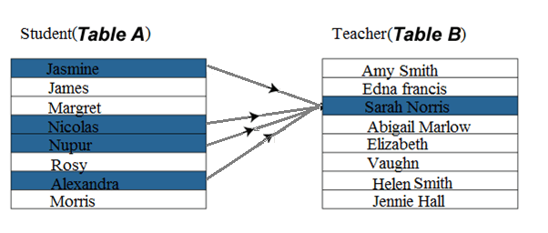
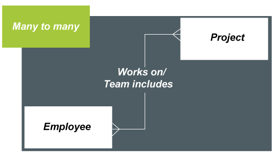

# SQL Ques
## 1. Find max and second max salary for a employee table MySQL
- Try this, n would be the nth item you would want to return
- https://stackoverflow.com/a/21520159/11962586
- ```SELECT DISTINCT(Salary) FROM table ORDER BY Salary DESC LIMIT n,1```

In your case
- ```SELECT DISTINCT(column_name) FROM table_name ORDER BY column_name DESC limit 2,1;```

## 2. Types of Relationship in DBMS
- One to One relationship
- 
- One to many or many to one relationship
- 
- 
- Many to many relationships
- 
- https://www.javatpoint.com/types-of-relationship-in-database-table

## 3. View in sql
- In SQL, a view is a virtual table based on the result-set of an SQL statement.
- A view contains rows and columns, just like a real table. The fields in a view are fields from one or more real tables in the database.
- You can add SQL statements and functions to a view and present the data as if the data were coming from one single table.
- A view is created with the CREATE VIEW statement.

```
CREATE VIEW Syntax
CREATE VIEW view_name AS
SELECT column1, column2, ...
FROM table_name
WHERE condition;
```

## 5. SQL FOREIGN KEY Constraint

```
CREATE TABLE Orders (
OrderID int NOT NULL,
OrderNumber int NOT NULL,
PersonID int,
PRIMARY KEY (OrderID),
FOREIGN KEY (PersonID) REFERENCES Persons(PersonID)
);
```

## 4. Joins in SQL
- Left join
- Right join
- inner join

