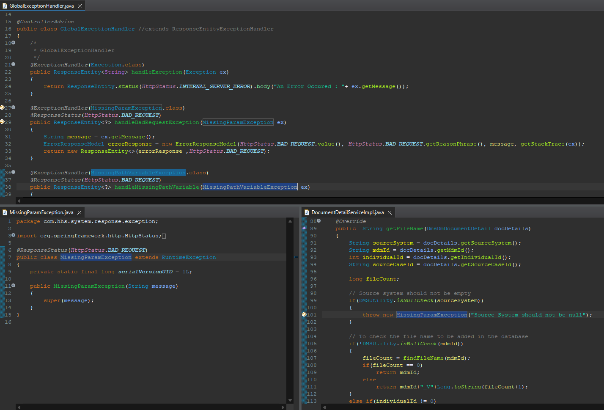
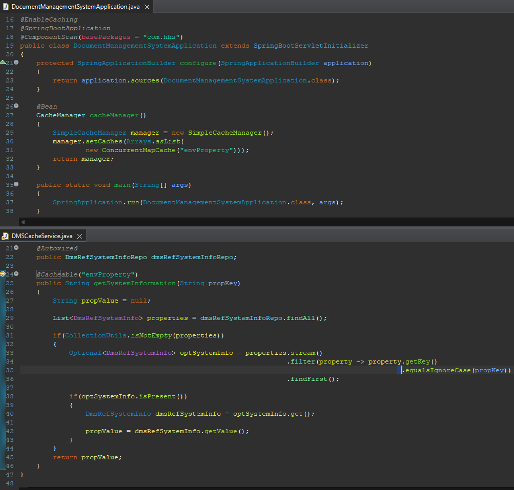

https://www.interviewbit.com/rest-api-interview-questions/
https://www.baeldung.com/spring-mvc-session-attributes

https://www.marcobehler.com/guides/spring-and-spring-boot-versions


## Difference between spring and spring boot?

| Sping                                                            | Spring boot        |                
|------------------------------------------------------------------|--------------------|
| Frame work                                                       | module of spring   |
| provides tools and libraries  <br/> to create customised web app | Spring app project |
| more complex                                                     | less complex       |


## Mention the need for it.
- Stand alone app
- Auto dependency
- Embedded  http servers
- Auto configuration
- Reduce developers  effort
- Reducing boiler plate code

## Features of spring boot
- Starter dependency
- Spring initializer
- Spring actuator
- Logging and security

## Possible sources of external configuration
- Application properties
- Command line properties
- Profile specific properties

## Attributes in spring
- @Autowired to create instance of interface class
- @ModelAttribute("location") Location location, ModelMap map)
- @PathVariable

## @Component, @Bean, @Configuration

### @Configuration

https://www.digitalocean.com/community/tutorials/spring-configuration-annotation
- Spring @Configuration annotation is part of the spring core framework. 
- Spring Configuration annotation indicates that the class has @Bean definition methods. 
- So Spring container can process the class and generate Spring Beans to be used in the application
### Class Declaration
```
  public class Company 
  {
      private Address address;
    
      public Company(Address address) {
      this.address = address;
      }

      // getter, setter and other properties
  }
```

### Collabrator
```
public class Address 
{
    private String street;
    private int number;

    public Address(String street, int number) {
        this.street = street;
        this.number = number;
    }

    // getters and setters
}
```

### Traditional Approach

Normally, we create objects with their classes' constructors:

```
Address address = new Address("High Street", 1000);
Company company = new Company(address);
```

### Bean Configuration

First off, let's decorate the Company class with the @Component annotation:

```
@Component
public class Company 
{
// this body is the same as before
}
```
Here's a configuration class supplying bean metadata to an IoC(Inversion of control) container:

```
@Configuration
@ComponentScan(basePackageClasses = Company.class)
public class Config 
{

    @Bean
    public Address getAddress() 
    {
        return new Address("High Street", 1000);
    }
}
```

### Life cycle of bean
- The lifecycle of any object means when & how it is born, how it behaves throughout its life, and when & how it dies. Similarly, the bean life cycle refers to when & how the bean is instantiated, what action it performs until it lives, and when & how it is destroyed. In this article, we will discuss the life cycle of the bean.


- 
#### Configre the life cycle methods by
1. XML configuration
2. Spring Interfaces
3. Annotations

https://bushansirgur.in/spring-boot-bean-annotation-with-example/


## JPARepository vs CRUDRepository

| JPA Repository | CRUD Repository                                     |                
|----------------|-----------------------------------------------------|
| JPA also provides some extra methods related to JPA <br/>such as delete records in batch and flushing data directly to a database.   | It provides only CRUD functions like findOne, saves, etc.               |


## How configuration works in Spring
- Spring @Configuration annotation is part of the spring core framework. 
- Spring Configuration annotation indicates that the class has @Bean definition methods. 
- So Spring container can process the class and generate Spring Beans to be used in the application.

  https://www.digitalocean.com/community/tutorials/spring-configuration-annotation


## Is REST API stateless or stateful?
- A. REST APIs are stateless because, rather than relying on the server remembering previous requests, REST applications require each request to contain all of the information necessary for the server to understand it.


## Spring Boot Architecture
- 
- 

## Spring Architecture
- The Model encapsulates the application data and in general they will consist of POJO.
- The View is responsible for rendering the model data and in general it generates HTML output that the client's browser can interpret.
- The Controller is responsible for processing user requests and building an appropriate model and passes it to the view for rendering.

## HandlerInterseptor & Filter
https://www.baeldung.com/spring-mvc-handlerinterceptor-vs-filter

## [Exception Handling in Spring boot](https://www.tutorialspoint.com/spring_boot/spring_boot_exception_handling.htm)

#### @ControllerAdvice
- to handle the exceptions globally.
#### @ExceptionHandler
 - to handle the specific exceptions and sending the custom responses to the client.



## [Annotations in Spring boot](https://www.javatpoint.com/spring-boot-annotations)
 - @SpringBootApplication
 - @EnableAutoConfiguration -
 - @Required - Applied at the bean setter method. This should be populated at configuration time with the required property.
 - @Autowired - provides annotation-based autowiring by providing @Autowired.
 - @Configuration - is a class level annotation.
 - @ComponentScan - @ComponentScan(basePackages = "com.javatpoint")
 - @Bean - is a method level annotation.
 - @Component - 
 - @Controller - 
 - @RestController - 
 - @RequestMapping - 
 - @GetMapping - 
 - @PutMapping - 
 - @PostMapping - 
 - @DeleteMapping - 
 - @PatchMapping -
  
  **Extract the values from the URI**

Spring Boot provides a wide range of parameter binding annotations for various purposes. Here are some other commonly used annotations beyond the ones you mentioned:

In Spring Boot, annotations are used to define various aspects of a method, such as request mapping, parameter binding, and more. The annotations you mentioned, `@PathVariable`, `@ModelAttribute`, and `@RequestParam`, are commonly used for handling different parts of an HTTP request. Here's an explanation of each of them:

1. `@PathVariable`: This annotation is used to extract values from the URI (Uniform Resource Identifier) template and bind them to method parameters. It's often used when you want to capture values from the URL, for example, in a RESTful API. Here's an example:

```java
@RequestMapping("/user/{id}")
public String getUser(@PathVariable("id") Long userId) {
    // Your code here
}
```

In this example, the `@PathVariable` annotation captures the `id` from the URL and maps it to the `userId` method parameter.

2. `@ModelAttribute`: This annotation is used to bind a method parameter to a model attribute, which is typically used in the context of the Model-View-Controller (MVC) pattern. It is commonly used to populate form objects and pass data between the controller and the view. Here's an example:

```java
@RequestMapping("/addUser")
public String addUser(@ModelAttribute User user) {
    // Your code here
}
```

In this example, the `@ModelAttribute` annotation binds the `User` object to the form data.

3. `@RequestParam`: This annotation is used to extract values from the request parameters, which are typically part of the query string in a URL. It's commonly used when you want to retrieve values from the query parameters of an HTTP request. Here's an example:

```java
@RequestMapping("/search")
public String searchUsers(@RequestParam("query") String searchQuery) {
    // Your code here
}
```
In this example, the `@RequestParam` annotation retrieves the `query` parameter from the request URL.

4. `@RequestBody`: This annotation is used to bind the request body to a method parameter. It is often used for handling JSON or XML request payloads in RESTful APIs.

```java
@PostMapping("/createUser")
public ResponseEntity<User> createUser(@RequestBody User user) {
    // Your code here
}
```

5. `@RequestHeader`: It's used to extract values from HTTP headers.

```java
@GetMapping("/userAgent")
public String getUserAgent(@RequestHeader("User-Agent") String userAgent) {
    // Your code here
}
```

6. `@CookieValue`: This annotation allows you to extract values from cookies in the request.

```java
@GetMapping("/getCookie")
public String getCookieValue(@CookieValue("sessionId") String sessionId) {
    // Your code here
}
```

7. `@RequestAttribute`: Used to access values stored as request attributes (usually set by an interceptor).

```java
@GetMapping("/processData")
public String processData(@RequestAttribute("someData") String data) {
    // Your code here
}
```

8. `@SessionAttribute`: It's used to bind a session attribute to a method parameter.

```java
@GetMapping("/getSessionData")
public String getSessionData(@SessionAttribute("userId") Long userId) {
    // Your code here
}
```

9. `@PathVariableMap` and `@RequestParamMap`: These annotations allow you to access all path or request parameters as a map.

10. `@ModelAttribute` on method arguments: In addition to annotating method parameters, you can also use `@ModelAttribute` at the method level to add common attributes to the model for all handler methods in the controller.

11. Custom annotations: You can create your custom annotations to encapsulate and abstract common parameter binding patterns.

Spring Boot and Spring MVC provide extensive support for handling various aspects of web requests and responses, so there are many more annotations available. The choice of which annotation to use depends on the specific requirements of your application and the data you need to handle within your controllers.
 


 - @Service  - 
 - @Repository - 
 - @EnableAutoConfiguration - 
 - @SpringBootApplication - 
 - @Cacheable("envProperty") - 
 - @InitBinder - To trim the values passed in @RequestParam and @ModelAttribute
 - @EntityGraph - 


## @Qualifier, @Primary, @Autowired, @Required
### @Qualifier
https://www.youtube.com/watch?v=2YC5pIXR7e4&ab_channel=SimpleProgramming
https://www.educative.io/courses/guide-spring-5-spring-boot-2/B1WwWk0pw5N#Why-is-@Qualifier-annotation-used?

### @Autowired
https://bushansirgur.in/spring-boot-autowire-annotation-with-example/

## @Controller vs @RestController
### @Controller
- In @Controller, we need to use @ResponseBody on every handler method.
- In @Controller, we can return a view in Spring Web MVC.
- In @Controller, we need to use @ResponseBody on every handler method.
- Specialization of @Component
- Serves as the roll of controller
- Used in Spring MVC
- The dispatcher scans such annotated classes for mapped methods and detects @RequestMapping annotations.

### @RestController
- In @RestController, we don’t need to use @ResponseBody on every handler method.
- In @RestController, we can not return a view.


## [@Transaction](https://stackoverflow.com/a/54326437/11962586)
- Used to roll back the process.
- If A is sending 100$ to B. If the transaction is not successful, then  roll back happens.

## [Dependency Injection](https://www.javatpoint.com/dependency-injection-in-spring)

Dependency Injection (DI) is a design pattern that removes the dependency from the programming code so that it can be easy to manage and test the application.
Dependency Injection makes our programming code loosely coupled.

Spring framework provides two ways to inject dependency

- By Constructor
- By Setter method

## SSO
### ```Single sign on``` with ```Spring security OAuth2```

## LDAP
The most common LDAP use case is providing a central location for accessing and managing directory services. 
LDAP enables organizations to store, manage, and secure information about the organization, its users, and assets–like usernames and passwords.

